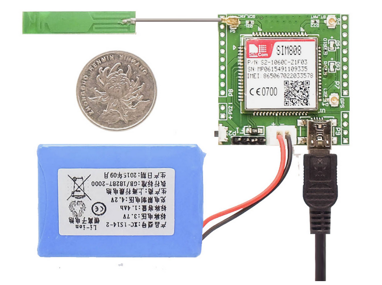
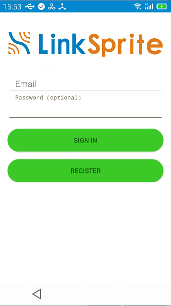
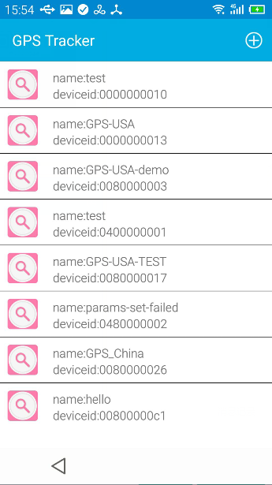
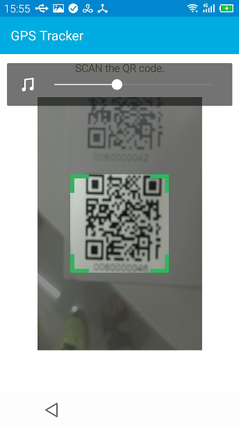
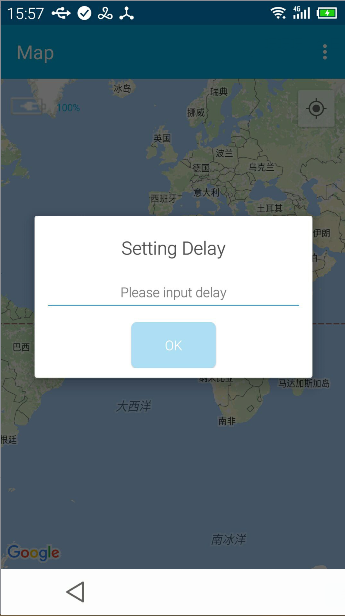
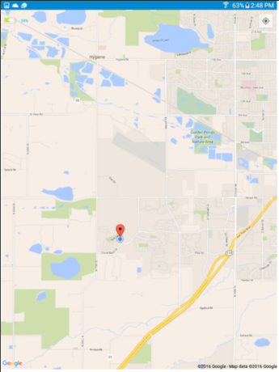

# 如何使用安卓APP查看GPS Tracker定位信息

GPS Tracker是一款便携式的全球定位设备，板上集成GPRS可以随时将数据上传到服务器，可以通过APP查看定位信息和设备电量。

下面介绍的是如何使用APP查看GPS Tracker的定位信息。

## 步骤

#### 1. 下载安转安卓APP
* 点击这里可以[下载APP](https://github.com/delongqilinksprite/gpschina.git) 然后安装APP。

#### 2. 登录注册 LinkSpriteIO
* 如果你已经在LinkSpriteIO上注册过, 在这里输入你的邮箱和密码, 然后点击 **SIGN IN**登陆。 
* 如果你还没有注册过LinkSpriteIO, 在这里输入邮箱和密码，点击 **REGISTER** 进行注册。

#### 3. 进入
* 点击加号按钮添加一个新的GPS Tracker设备。

#### 4. 扫描 GPS Tracker上的二维码  
* 获得设备信息，注册添加此设备。  

#### 5. 设置"delay"参数
* GPS上报数据的时间，单位秒。  
  

#### 6.  启动GPS Tracker电源，查看数据  
* 长按三秒启动设备，在空旷的地方，等待一段时间，在APP中查看GPS信息。

